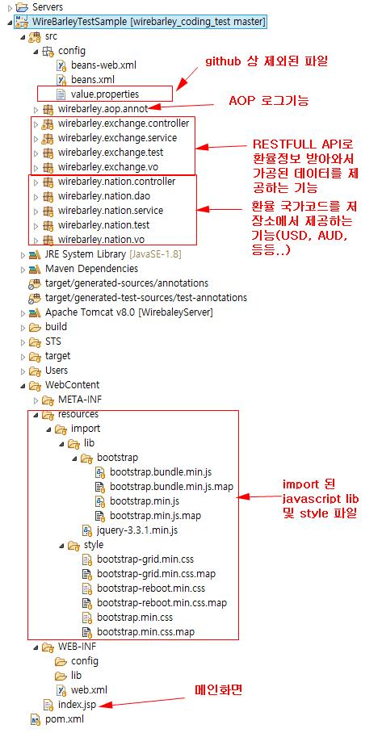
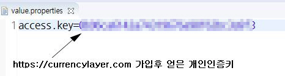
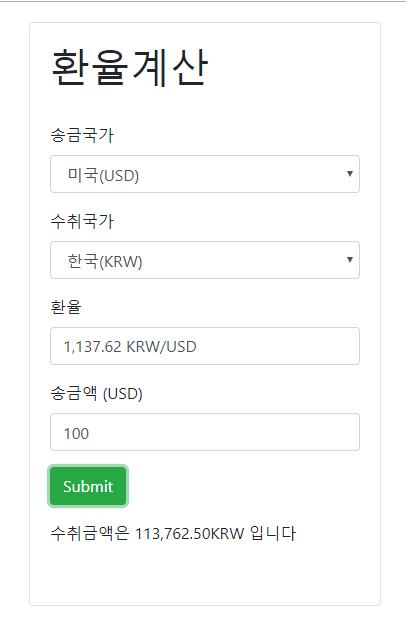

# wirebarley_coding_test

## 코딩 문제
Link: https://github.com/wirebarley/apply/blob/master/coding_test_type_B.md

## 프로젝트 구조

1. value.properties에는 환율정보를 받아올때 쓰는 개인키 정보가 들어있어서 github상에는 업로드되지 않았습니다
WAS 구동시 value.properties 생성후 아래 그림의 모자이크된 부분에 개인키 정보를 입력합니다

2. wirebarley.exchange 패키지는 https://currencylayer.com/에서 RESTful 방식으로 환율정보를 받아올 수 있습니다
환율정보를 받아오는 소스는 wirebarley.exchange.service 패키지의 구현부분을 들어가시면 확인할 수 있습니다.
3. wirebarley.nation 패키지는 국가이름, 국가환율코드, 송금수치포지션 정보를 관리하는 코드입니다
DB를 이용하여 정보를 검색을 해야하나 편의상 DAO단에서 List형태를 가지고 있다가(하드코딩) 제공하는 형태로
만들어졌습니다.
4.WebContent/resources 이하 폴더는 HTML 상에서 사용되는 javascript 파일과 style 파일을 관리합니다
5.index.jsp는 결과 화면을 담당합니다

## 실행 후 결과

## 오류
https://currencylayer.com/에서 RESTful로 미국 달러 기반의 환율정보(KRW/USD, JPY/USD, PHP/USD)는 제공하나 
호주 달러 기반의 환율정보(KRW/AUD, JPY/AUD, PHP/AUD)는 제공하지 않습니다.

그래서 얻고자 하는 두 국가의 미국 달러 정보를 나누어서
예를 들어 한국과 미국 달러, 호주와 미국 달러 정보를 구해서 나누어서 한국의 호주달러 환율을 얻고자 했으나
실제 값을 비교해보니 약간의 오차가 있어서 구현하지 않았습니다.
https://currencylayer.com/에서 호주 달러 기반의 환율정보를 제공한다면 지금 서비스에서 구현한 환율정보
코드는 이상없이 돌아가도록 구현하였습니다.

